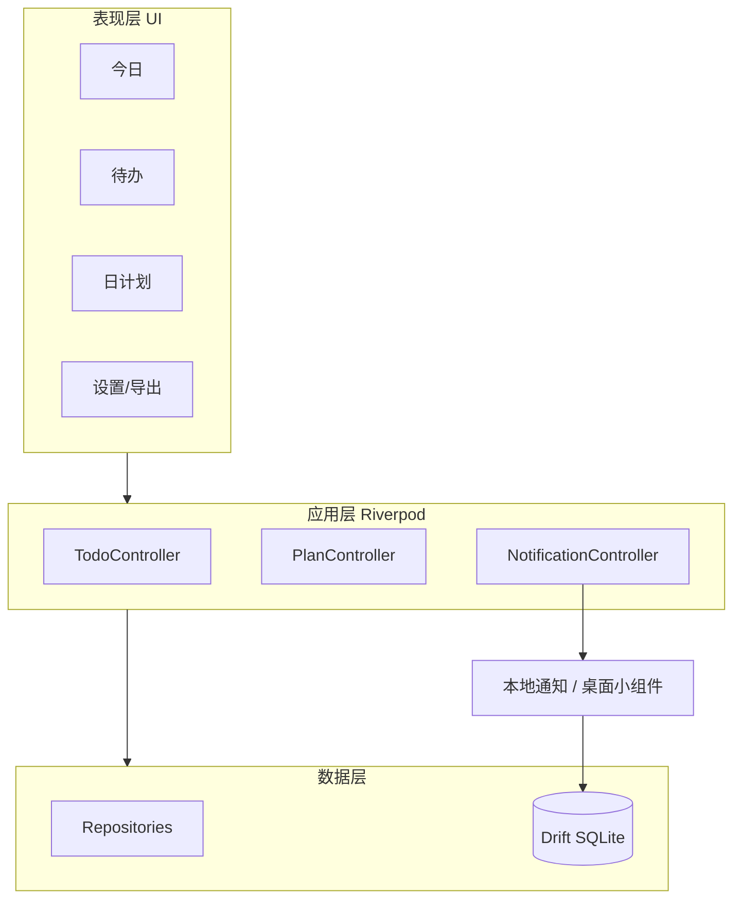

# 轨道 Orbit · 架构设计

## 1. 关键决策

| 决策 | 选择 | 原因 |
| --- | --- | --- |
| 客户端 | Flutter | 桌面小组件生态更顺；一套代码双端；用户选定 |
| 状态管理 | Riverpod | 轻量、可测，适合单人/小项目 |
| 路由 | go_router | 与 Flutter 官方生态一致，便于通知深链 |
| 本地存储 | Drift（SQLite） | 待办/计划为结构化数据；离线；通知与小组件读本机 |
| 服务端 V1 | 无 | 先自用、local-first，降低运维与隐私成本 |
| 云端 V2 | Supabase 或 Node + PostgreSQL | 仅在多设备/对外时引入；不与本地库二选一 |
| 包名 | `com.orbit.life` | 产品为轨道 Orbit；避开过于泛化的裸 `orbit` |

### 为何 V1 不用 PostgreSQL

PostgreSQL 是服务端库，不能替代手机本地存储。通知与桌面小组件需要离线读「今天」的数据。V1 只用 SQLite；若将来多设备同步，采用 **本地 Drift + 云端 PostgreSQL** 双层，而不是一开始只上 PG。

## 2. 技术栈

| 层 | 选型 | 用途 |
| --- | --- | --- |
| UI | Flutter + Dart | Android / iOS 客户端 |
| 状态 | Riverpod | 业务状态、依赖注入 |
| 导航 | go_router | 路由、深链 |
| 数据库 | Drift + SQLite | 本地持久化 |
| 通知 | flutter_local_notifications + timezone | 本地定时提醒 |
| 小组件 | home_widget | Android AppWidget / iOS WidgetKit |
| 导出 | 应用内 JSON | 备份与迁移 |
| 测试 | flutter_test + Drift 单元测试 | 仓储与用例 |

## 3. 逻辑分层



原则：

- UI 不直接写 SQL；只依赖 Repository / Provider。
- 通知与小组件与 App **共享同一份本地数据**，避免双份真相。
- 领域模型与 Drift 表分离，便于测试与以后同步。

## 4. 规划目录结构

```text
orbit/
  README.md
  docs/
    PRODUCT.md
    ARCHITECTURE.md
    DATA_MODEL.md
  lib/
    main.dart
    app.dart
    core/           # 主题、常量、时间工具、结果类型
    database/       # Drift 表、连接、迁移
    features/
      todo/         # 待办：data / domain / application / presentation
      plan/         # 日计划
      notification/ # 本地通知调度
      widget/       # 小组件桥接与今日数据导出
      export/       # JSON 导出
    shared/         # 通用组件
  test/
  android/
  ios/              # 后续在 macOS/CI 上完善
```

脚手架时使用组织域 `com.orbit`，应用 ID `com.orbit.life`。

## 5. 关键链路

### 5.1 新建待办并提醒

1. UI 提交标题、日期、提醒时间、分类。
2. TodoController 校验后写入 Repository。
3. Drift 落库，返回稳定 ID。
4. NotificationController 根据提醒时间注册本地通知。
5. 到点系统通知；点击深链进入待办详情。

### 5.2 桌面小组件「今日」

1. App 数据变更后通过 home_widget 写入小组件可用的精简快照（或小组件读 App Group / 同库约定）。
2. 小组件展示今日未完成列表。
3. 用户在小组件勾选 → 通知 App 侧更新 DB → 快照刷新。

### 5.3 完成 / 改期

- 完成：`status = done` + `completed_at`，不物理删除。
- 改期：更新 `scheduled_for`；若原提醒仍有效则重排通知。

## 6. 平台约束

| 平台 | V1 策略 |
| --- | --- |
| Android | 主开发与验收端；通知与小组件优先打通 |
| iOS | 工程结构预留；打包与 WidgetKit 需 macOS 或 CI |
| Windows 开发机 | 已安装 Flutter SDK，可 Android 构建与测试 |

## 7. 非功能

- **离线**：无网络可完整使用 V1。
- **隐私**：数据仅存本机；导出由用户主动触发。
- **性能**：今日列表与小组件查询按日期索引，数据量个人级可忽略复杂优化。
- **可测试**：Repository 可注入假实现；通知调度可单测参数生成。

## 8. V2+ 架构预留（不做实现）

- 同步：本地变更队列 + 云端 PostgreSQL（Supabase / Node）。
- 身份：可选账号；匿名期纯本地。
- 模块：`domain` 字段扩展 project / study / work / life，界面后挂，不在 V1 出现。

## 9. 依赖版本策略

脚手架时以 `flutter create` 默认约束为基线，再添加：

- `flutter_riverpod`
- `go_router`
- `drift` + `drift_flutter`（或等价 SQLite 驱动）+ `sqlite3_flutter_libs`
- `flutter_local_notifications`
- `timezone`
- `home_widget`
- `path_provider`
- `intl`

具体版本以创建时 `flutter pub` 解析结果为准，锁定在 `pubspec.lock`。
