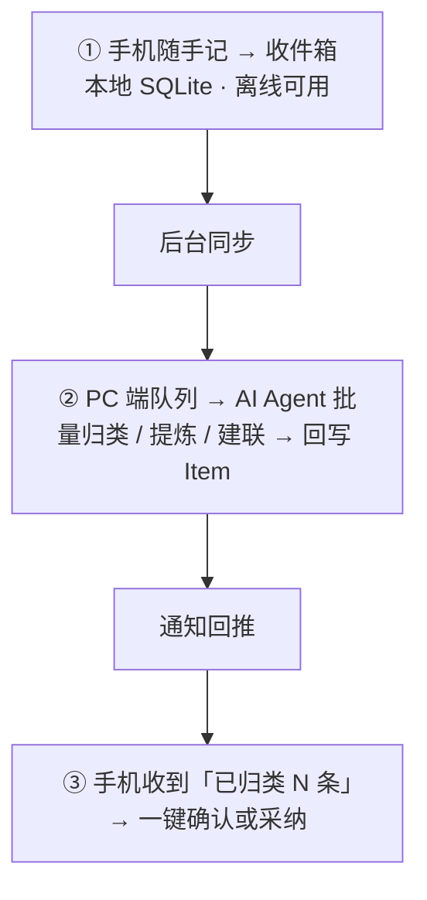

# 轨道 Orbit · 端协同与 AI 自动化（V2 蓝图）

状态：架构决策已定，视觉稿已画（移动端画布 08 屏）。**V1 不实现**，本文档承接方向，防止 V1 设计时把路堵死。

## 1. 核心决策：三端分工

移动端不该承担自动化——它的定位就是采集 + 查看 + 轻动作；重加工全部放在 PC 端 + AI Agent 层。

| 端 | 角色 | 承担什么 |
| --- | --- | --- |
| **手机（Orbit App）** | 采集端 / 查看端 | 快速捕获（文字/语音/分享面板）、今日概览、待办打勾、收通知、小组件贴片 |
| **PC（知识中枢）** | 加工端 / 编排端 | AI 批量归类收件箱、三层知识整理（L1 原料 / L2 主题 / L3 项目）、任务流水线编排、MCP 工具调用 |
| **AI Agent 层** | 自动化引擎 | 定时批处理、规则引擎、MCP 工具执行 |

原则：**手机不跑大模型**。手机端 AI 只做零成本的轻量本地规则（见 §3）。

## 2. 收件箱异步加工流水线

用户只负责**捕获和确认**，加工是异步的——这正是移动端适合的交互模型。

- 收件箱是 Orbit 的一切入口（V2 数据模型见 §6 统一 Item）。
- 加工结果以通知回推，用户保持「确认权」，AI 不静默改数据。

## 3. 移动端被动自动化（可在 V1b 后渐进引入）

不在手机里跑 AI，靠四类被动自动化：

| 能力 | 技术 | 说明 |
| --- | --- | --- |
| 后台任务 | workmanager | 每晚自动汇总当天、清理过期、预生成明日概览 |
| 智能提醒 | flutter_local_notifications | 基于时间/位置/习惯规律触发，而非傻闹钟 |
| 系统级捕获 | share_receive / 语音输入 / home_widget 按钮 | 分享面板一键进收件箱、语音快捷输入、小组件快速捕获 |
| 轻量本地规则 | 正则 | 如含「¥」自动标开销，零 AI 消耗 |

## 4. Orbit MCP Server（二期）

Orbit 暴露自己的 MCP server，让任何支持 MCP 的 Agent（Claude 等）都能操作生活数据——「把生活塞进软件」的终极形态是 agent 替你操作软件。

| 工具 | 用途 |
| --- | --- |
| `query_items` | 按类型 / 标签 / 时间检索生活数据 |
| `create_item` | 待办 / 事件 / 笔记一键创建 |
| `update_status` | 完成状态、归属项目流转 |
| `query_stats` | 情绪 / 开销 / 习惯趋势统计 |

## 5. 分期路线

| 阶段 | 内容 |
| --- | --- |
| 一期（V1/V1b） | 手机 App（本地优先）+ **PC 本地 Web**——PC 端不重做，直接按「项目知识中枢 Web App」视觉稿实现（见 [DESIGN.md](DESIGN.md)） |
| 二期 | 端云同步（本地 Drift + 云端 PostgreSQL）+ Orbit MCP Server + Agent 自动化闭环 |

## 6. 与既有文档的关系

- [DATA_MODEL.md](DATA_MODEL.md) 的 `domain` 字段是统一 Item 模型的前身：V2 演进为 `type: todo | event | expense | mood | note | habit | link`，配 `tags[] / links[] / source` 字段，收件箱先落 `inbox` 再归类。
- [ARCHITECTURE.md](ARCHITECTURE.md) §8 的同步预留（本地变更队列 + 云端 PostgreSQL）直接承接本文档的端间流水线。
- PC 端知识中枢的三层模型（L1 紫 `#9B5DE5` / L2 橙 `#F26430` / L3 绿 `#0F9D58`）与移动端画布共用同一套设计语言（见 [DESIGN.md](DESIGN.md)）。
