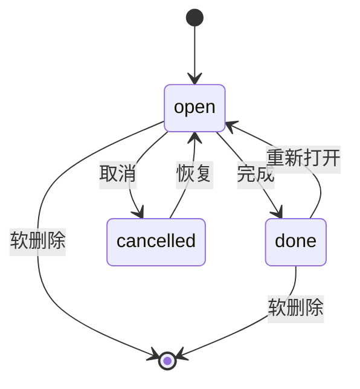

# 轨道 Orbit · 数据模型（V1）

本地 Drift（SQLite）。设计原则：结构够用、字段可同步、软删除可恢复、领域可扩展。

## 1. 约定

| 约定 | 说明 |
| --- | --- |
| ID | 客户端生成稳定 ID（如 UUID 字符串），不依赖自增主键做同步身份 |
| 时间 | 一律 UTC ISO-8601 存库；展示层转本地时区 |
| 软删除 | `deleted_at` 非空表示已删；默认查询过滤 |
| 可同步 | `created_at` / `updated_at` 必填；`updated_at` 变更时更新 |
| 领域 | `domain` 区分轨道类型，V1 仅用 todo / plan，字段从第一天就存在 |

## 2. 表：`todos`

| 字段 | 类型 | 说明 |
| --- | --- | --- |
| id | TEXT PK | 稳定 ID |
| domain | TEXT | V1 固定 `todo` |
| title | TEXT | 必填 |
| notes | TEXT | 可空备注 |
| status | TEXT | `open` \| `done` \| `cancelled` |
| priority | INTEGER | 0 低 / 1 中 / 2 高，默认 1 |
| category_id | TEXT FK → categories | 可空 |
| scheduled_for | TEXT | 计划日期 `YYYY-MM-DD`（本地日） |
| remind_at | TEXT | 提醒时刻 UTC，可空 |
| repeat_rule | TEXT | 可空；如 `daily` / `weekdays` / 简单 RRULE 子集 |
| completed_at | TEXT | 完成时间 UTC，可空 |
| sort_order | INTEGER | 同日排序 |
| created_at | TEXT | UTC |
| updated_at | TEXT | UTC |
| deleted_at | TEXT | UTC，可空 |

索引建议：

- `(scheduled_for, status, deleted_at)` — 今日列表
- `(remind_at)` — 通知重调度
- `(category_id)`

## 3. 表：`plan_items`

日计划：某一天有序的安排块。与 todo 可关联，也可独立存在。

| 字段 | 类型 | 说明 |
| --- | --- | --- |
| id | TEXT PK | 稳定 ID |
| domain | TEXT | V1 固定 `plan` |
| day | TEXT | `YYYY-MM-DD` |
| title | TEXT | 必填 |
| notes | TEXT | 可空 |
| start_at | TEXT | 可空，UTC；无则纯列表项 |
| end_at | TEXT | 可空，UTC |
| status | TEXT | `open` \| `done` \| `cancelled` |
| todo_id | TEXT FK → todos | 可空；关联待办 |
| sort_order | INTEGER | 当日顺序 |
| created_at / updated_at / deleted_at | TEXT | 同约定 |

索引：`(day, deleted_at, sort_order)`

## 4. 表：`categories`

V1 一级分类，预置工作 / 学习 / 生活，可增改。

| 字段 | 类型 | 说明 |
| --- | --- | --- |
| id | TEXT PK | |
| name | TEXT | 显示名 |
| color | TEXT | 十六进制色，可空 |
| sort_order | INTEGER | |
| is_archived | INTEGER | 0/1 |
| created_at / updated_at / deleted_at | TEXT | |

## 5. 表：`widget_snapshots`（逻辑视图，实现可选）

小组件不跑完整业务时，可由 App 写入精简快照：

| 字段 | 类型 | 说明 |
| --- | --- | --- |
| key | TEXT PK | 如 `today` |
| payload | TEXT | JSON：今日未完成条目摘要 |
| updated_at | TEXT | |

若使用 home_widget 的存储通道，此表可改为文件/Preferences；原则是 **与 todos 同源、变更后刷新**。

## 6. 领域扩展（V2+，仅预留）

后续卫星模块不新建无关库，优先：

- 复用 `domain` 值：`project` / `study` / `work` / `life`
- 或为强结构模块加表（如 `projects`、`study_sessions`），外键可回指 `todos`

V1 不实现这些表。

## 7. JSON 导出形状（草案）

```json
{
  "app": "orbit",
  "schema_version": 1,
  "exported_at": "2026-09-18T12:00:00Z",
  "categories": [],
  "todos": [],
  "plan_items": []
}
```

导入功能 V1 可不做强保证，但导出字段与表结构对齐，降低以后迁移成本。

## 8. 通知与模型的关系

- `remind_at` / `repeat_rule` 是调度输入。
- 完成或删除待办时取消对应通知 ID。
- 通知 ID 建议：`todo_<id>` 或哈希，避免重复注册。

## 9. 状态机（待办）



改期不改变 status，只更新 `scheduled_for` 与通知。
